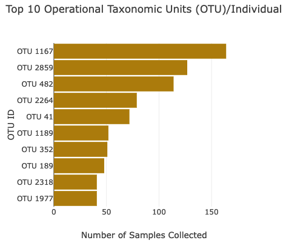
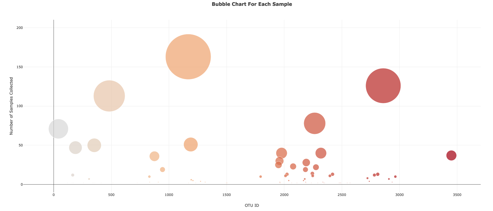
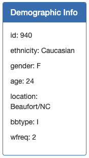
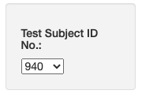
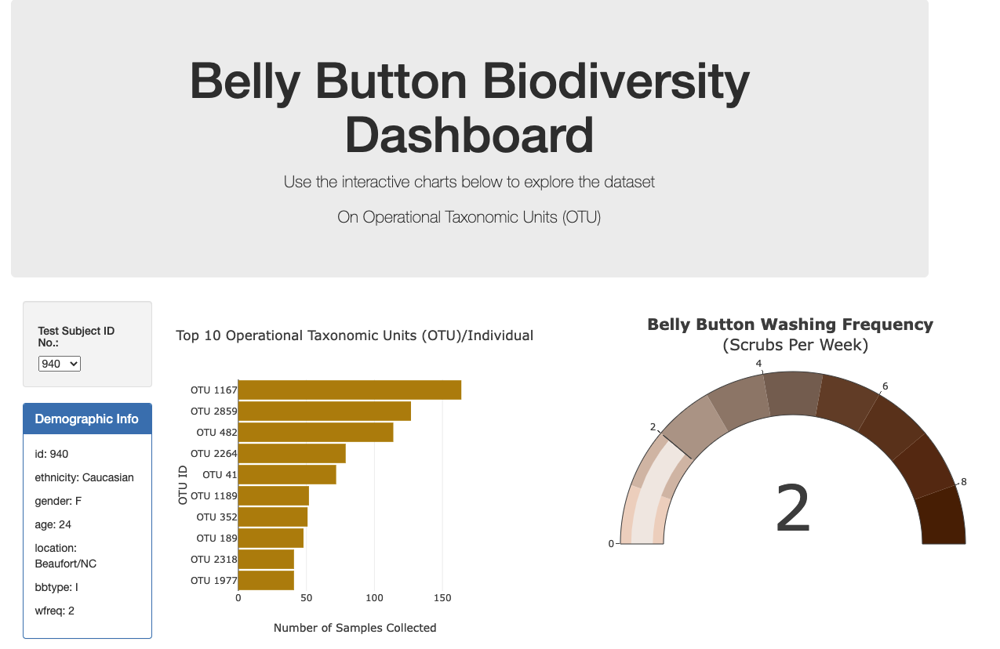
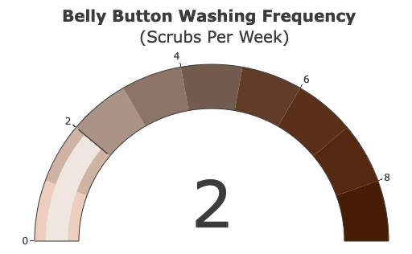

# Plot.ly Homework - Belly Button Biodiversity

In this project, I built an interactive dashboard to explore the [Belly Button Biodiversity dataset](http://robdunnlab.com/projects/belly-button-biodiversity/), which catalogs the microbes that colonize human navels.

The dataset reveals that a small handful of microbial species (also called operational taxonomic units, or OTUs, in the study) were present in more than 70% of people, while the rest were relatively rare.

## Step 1: Plotly
Below is the step by step approach taken to complete the first part (Step 1) of this project:

The `samples.json` file was read in using the D3 library. Then, I created a horizontal bar chart with a dropdown menu to display the top 10 OTUs found in that individual using the `sample_values` as the values for the bar chart.
In setting up the layout for the bar chart, I used the `otu_ids` as the labels for the bar chart and used the `otu_labels` as the hovertext for the chart.

  

I then created a bubble chart that displays each sample using the following as parameters for the chart:

  * `otu_ids` for the x values.

  * `sample_values` for the y values.

  * `sample_values` for the marker size.

  * `otu_ids` for the marker colors.

  * `otu_labels` for the text values.

A Display of the sample metadata was also shown as a summary in the Demographic Info table as shown below with each key-value pair from the metadata JSON object somewhere on the page.

I also set up a drop down menu that updates all of the plots any time that a new sample is selected from that drop down menu.

Additionally, I created the layout that was used for the dashboard. The dashboard layout with the graphs is shown below:

## Step 2: Guage Chart

I adopted the Gauge Chart from <https://plot.ly/javascript/gauge-charts/> to plot the weekly washing frequency of the individual. I set the chart to pdate whenever a new sample is selected.

- - -

## References

Hulcr, J. et al.(2012) _A Jungle in There: Bacteria in Belly Buttons are Highly Diverse, but Predictable_. Retrieved from: [http://robdunnlab.com/projects/belly-button-biodiversity/results-and-data/](http://robdunnlab.com/projects/belly-button-biodiversity/results-and-data/)

- - -
